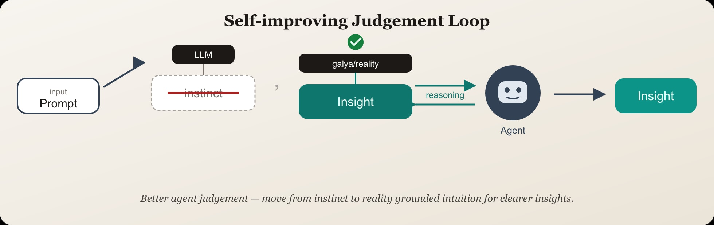

# galya/reality

> **Agents:** read [`skills.md`](./skills.md) first — SDK usage, integrations, and how to fetch these Fumadocs docs (`/llms.txt`, `.md` pages, `/api/search`).

Better agent judgement — move from instinct to reality grounded intuition for clearer insights.

Install in Python or TypeScript, then resolve named validators from Galya’s
shared catalog and score context with a simple `index` / `judge` API.

## Self-improving Judgement Loop



*Better agent judgement — move from instinct to reality grounded intuition for clearer insights.*

## Quick start

### Python

```bash
pip install galya-reality
```

```python
import galya_reality as reality

client = reality.validator("galya-taste")
await client.index(message, context)
result = await client.judge(message, context)
print(result.score, result.label, result.explanations)
```

Example `judge()` response:

```python
ValidationResult(
    score=0.92,
    label="pass",
    rationale="Response aligns with expected taste signals",
    explanations=[
        "Tone matches brand voice",
        "No policy-sensitive content detected",
    ],
    metadata={},
)
```

### TypeScript

```bash
npm install @galya/reality
```

```typescript
import { validator } from "@galya/reality";

const client = await validator("galya-taste");
await client.index(message, context);
const result = await client.judge(message, context);
console.log(result.score, result.label, result.explanations);
```

Example `judge()` response:

```json
{
  "score": 0.92,
  "label": "pass",
  "rationale": "Response aligns with expected taste signals",
  "explanations": [
    "Tone matches brand voice",
    "No policy-sensitive content detected"
  ],
  "metadata": {}
}
```

`explanations` is optional — validators may omit it when they only return a score.

## Integrations

### Mastra (TypeScript)

Plug Galya into **your** agent via a scorer — model, tools, and instructions stay yours:

```typescript
import { Agent } from "@mastra/core/agent";
import { createGalyaScorer } from "./galya-scorer.js"; // see examples/mastra

const agent = new Agent({
  // …your agent config
  scorers: {
    galya: {
      scorer: createGalyaScorer({ validatorName: "galya-taste" }),
      sampling: { type: "ratio", rate: 1 },
    },
  },
});
```

Full helper + tests: [`examples/mastra`](./examples/mastra).

### LangGraph (Python)

Plug Galya nodes into **your** graph — draft/agent stays yours:

```python
from galya_reality_langgraph import make_galya_index_node, make_galya_judge_node

graph.add_node("draft", my_draft_node)  # yours
graph.add_node("galya_index", make_galya_index_node(validator_name="galya-taste"))
graph.add_node("galya_judge", make_galya_judge_node(validator_name="galya-taste"))
```

Full helpers + tests: [`examples/langgraph`](./examples/langgraph).

Docs: [Validators](./docs/content/docs/validators) · [Integrations](./docs/content/docs/integrations).

## How it works

1. Call `validator("name")` with a catalog name.
2. On first use, Galya installs that validator at a pinned version (you’ll be
   asked to confirm unless auto-install is enabled).
3. Use `.index()` to stream context and `.judge()` to get a score, optional
   label, rationale, and explanations.

Validators may be available in Python, TypeScript, or both. If you request a
name that isn’t available in your language, you’ll get a clear error listing
what *is* supported.

## Configuration

| Variable | Purpose |
|----------|---------|
| `GALYA_AUTO_INSTALL=1` | Skip the install confirmation prompt |
| `GALYA_REGISTRY_URL` | Optional custom catalog URL |
| `GALYA_CACHE_DIR` | Override cache directory (default `~/.cache/galya-reality`) |

## Documentation

Product docs live in [`docs/`](./docs/) (Fumadocs + Next.js), organized as:

- **Capabilities** — [API model](./docs/content/docs/capabilities/api-model.mdx), [index()](./docs/content/docs/capabilities/indexing.mdx), [judge()](./docs/content/docs/capabilities/judge.mdx)
- **Validators** — what they are, [Galya](./docs/content/docs/validators/galya.mdx), [write your own](./docs/content/docs/validators/write-your-own.mdx)
- **Integrations** — [Mastra](./docs/content/docs/integrations/mastra.mdx), [LangGraph](./docs/content/docs/integrations/langgraph.mdx)

To run locally:

```bash
cd docs && npm install && npm run dev
```

On Vercel, import this repo and set the **Root Directory** to `docs`.

## Building your own validator

Ship a validator in your own repository (Python, TypeScript, or both), then
propose it for the catalog. See [CONTRIBUTING.md](./CONTRIBUTING.md).

## Security

Validators run as third-party code in your process — the same trust model as
any pip or npm package. Read [SECURITY.md](./SECURITY.md) before installing
community validators in production.

## License

[Apache-2.0](./LICENSE)
